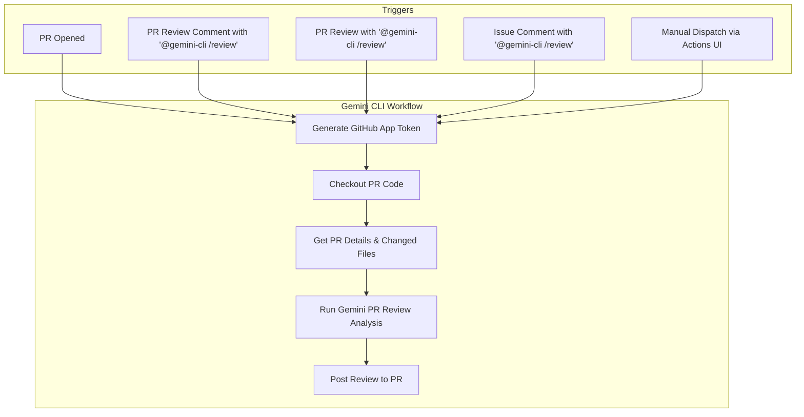

# PR Review with Gemini CLI

This document explains how to use the Gemini CLI on GitHub to automatically review pull requests with AI-powered code analysis.

- [PR Review with Gemini CLI](#pr-review-with-gemini-cli)
  - [Overview](#overview)
  - [Features](#features)
  - [Setup](#setup)
    - [Prerequisites](#prerequisites)
    - [Setup Methods](#setup-methods)
  - [Dependencies](#dependencies)
  - [Usage](#usage)
    - [Supported Triggers](#supported-triggers)
  - [Interaction Flow](#interaction-flow)
    - [Automatic Reviews](#automatic-reviews)
    - [Manual Reviews](#manual-reviews)
    - [Custom Review Instructions](#custom-review-instructions)
    - [Manual Workflow Dispatch](#manual-workflow-dispatch)
  - [Review Output Format](#review-output-format)
    - [📋 Review Summary (Overall Comment)](#-review-summary-overall-comment)
    - [Specific Feedback (Inline Comments)](#specific-feedback-inline-comments)
  - [Review Areas](#review-areas)
  - [Configuration](#configuration)
    - [Workflow Customization](#workflow-customization)
    - [Review Prompt Customization](#review-prompt-customization)
  - [Examples](#examples)
    - [Basic Review Request](#basic-review-request)
    - [Security-Focused Review](#security-focused-review)
    - [Performance Review](#performance-review)
    - [Breaking Changes Check](#breaking-changes-check)
  - [Extending to Support Forks](#extending-to-support-forks)
    - [1. Simple Fork Support](#1-simple-fork-support)
    - [2. Using `pull_request_target` Event](#2-using-pull_request_target-event)

## Overview

The PR Review workflow uses Google's Gemini AI and [code review extension](https://github.com/gemini-cli-extensions/code-review) to provide comprehensive code reviews for pull requests. It analyzes code quality, security, performance, and maintainability while providing constructive feedback in a structured format.

## Features

- **Automated PR Reviews**: Triggered on PR creation, updates, or manual requests
- **Comprehensive Analysis**: Covers security, performance, reliability, maintainability, and functionality
- **Priority-based Feedback**: Issues categorized by severity (Critical, High, Medium, Low)
- **Positive Highlights**: Acknowledges good practices and well-written code
- **Custom Instructions**: Support for specific review focus areas
- **Structured Output**: Consistent markdown format for easy reading
- **Failure Notifications**: Posts a comment on the PR if the review process fails.

## Setup

For detailed setup instructions, including prerequisites and authentication, please refer to the main [Getting Started](../../../README.md#quick-start) section and [Authentication documentation](../../../docs/authentication.md).

### Prerequisites

Add the following entries to your `.gitignore` file to prevent PR review artifacts from being committed:

```gitignore
# gemini-cli settings
.gemini/

# GitHub App credentials
gha-creds-*.json
```

### Setup Methods

To use this workflow, you can use either of the following methods:

1. Run the `/setup-github` command in Gemini CLI on your terminal to set up workflows for your repository.
2. Copy the workflow files into your repository's `.github/workflows` directory:

```bash
mkdir -p .github/workflows
curl -o .github/workflows/gemini-dispatch.yml https://raw.githubusercontent.com/google-github-actions/run-gemini-cli/main/examples/workflows/gemini-dispatch/gemini-dispatch.yml
curl -o .github/workflows/gemini-review.yml https://raw.githubusercontent.com/google-github-actions/run-gemini-cli/main/examples/workflows/pr-review/gemini-review.yml
```

> **Note:** The `gemini-dispatch.yml` workflow is designed to call multiple
> workflows. If you are only setting up `gemini-review.yml`, you should comment out or
> remove the other jobs in your copy of `gemini-dispatch.yml`.

## Dependencies

This workflow relies on the [gemini-dispatch.yml](../gemini-dispatch/gemini-dispatch.yml) workflow to route requests to the appropriate workflow.

## Usage

### Supported Triggers

The Gemini PR Review workflow is triggered by:

- **New PRs**: When a pull request is opened or reopened
- **PR Review Comments**: When a review comment contains `@gemini-cli /review`
- **PR Reviews**: When a review body contains `@gemini-cli /review`
- **Issue Comments**: When a comment on a PR contains `@gemini-cli /review`
- **Manual Dispatch**: Via the GitHub Actions UI ("Run workflow")

## Interaction Flow

The workflow follows a clear, multi-step process to handle review requests:



### Automatic Reviews

The workflow automatically triggers on:

- **New PRs**: When a pull request is opened

### Manual Reviews

Trigger a review manually by commenting on a PR:

```
@gemini-cli /review
```

### Custom Review Instructions

You can provide specific focus areas by adding instructions after the trigger:

```
@gemini-cli /review focus on security
@gemini-cli /review check performance and memory usage
@gemini-cli /review please review error handling
@gemini-cli /review look for breaking changes
```

### Manual Workflow Dispatch

You can also trigger reviews through the GitHub Actions UI:

1. Go to Actions tab in your repository
2. Select "Gemini PR Review" workflow
3. Click "Run workflow"
4. Enter the PR number to review

## Review Output Format

The AI review follows a structured format, providing both a high-level summary and detailed inline feedback.

### 📋 Review Summary (Overall Comment)

After posting all inline comments, the action submits the review with a final summary comment that includes:

- **Review Summary**: A brief 2-3 sentence overview of the pull request and the overall assessment.
- **General Feedback**: High-level observations about code quality, architectural patterns, positive implementation aspects, or recurring themes that were not addressed in inline comments.

### Specific Feedback (Inline Comments)

The action provides specific, actionable feedback directly on the relevant lines of code in the pull request. Each comment includes:

- **Priority**: An emoji indicating the severity of the feedback.
  - **Critical**: Must be fixed before merging (e.g., security vulnerabilities, breaking changes).
  - **High**: Should be addressed (e.g., performance issues, design flaws).
  - **Medium**: Recommended improvements (e.g., code quality, style).
  - **Low**: Nice-to-have suggestions (e.g., documentation, minor refactoring).
- **Suggestion**: A code block with a suggested change, where applicable.

**Example Inline Comment:**

> Use camelCase for function names
>
> ```suggestion
> myFunction
> ```

## Review Areas

Gemini CLI analyzes multiple dimensions of code quality:

- **Security**: Authentication, authorization, input validation, data sanitization
- **Performance**: Algorithms, database queries, caching, resource usage
- **Reliability**: Error handling, logging, testing coverage, edge cases
- **Maintainability**: Code structure, documentation, naming conventions
- **Functionality**: Logic correctness, requirements fulfillment

## Configuration

### Workflow Customization

You can customize the workflow by modifying:

- **Timeout**: Adjust `timeout-minutes` for longer reviews
- **Triggers**: Modify when the workflow runs
- **Permissions**: Adjust who can trigger manual reviews
- **Core Tools**: Add or remove available shell commands

### Review Prompt Customization

The review prompt utilizes [code review extension](https://github.com/gemini-cli-extensions/code-review) and its defined prompt.

**To customize the review prompt:**

1. Copy the TOML file to your repository:

   ```bash
   mkdir -p .gemini/commands
   curl -o .gemini/commands/gemini-review.toml https://raw.githubusercontent.com/gemini-cli-extensions/code-review/main/commands/code-review.toml
   ```

2. Edit `.gemini/commands/gemini-review.toml` to customize:
   - Focus on specific technologies or frameworks
   - Emphasize particular coding standards
   - Include project-specific guidelines
   - Adjust review depth and focus areas

3. Edit `.github/workflows/gemini-review.yml` to use the customized prompt:

   ```diff
   - prompt: '/pr-code-review'
   + prompt: '/gemini-review'
   ```

4. Commit the file to your repository:
   ```bash
   git add .gemini/commands/gemini-review.toml
   git commit -m "feat: customize PR review prompt"
   ```

The workflow will use your custom TOML file instead of the default one from the action.

For more details on workflow configuration, see the [Configuration Guide](../CONFIGURATION.md#custom-commands-toml-files).

## Examples

### Basic Review Request

```
@gemini-cli /review
```

### Security-Focused Review

```
@gemini-cli /review focus on security vulnerabilities and authentication
```

### Performance Review

```
@gemini-cli /review check for performance issues and optimization opportunities
```

### Breaking Changes Check

```
@gemini-cli /review look for potential breaking changes and API compatibility
```

## Extending to Support Forks

By default, this workflow is configured to work with pull requests from branches
within the same repository, and does not allow the `pr-review` workflow to be
triggered for pull requests from branches from forks. This is done because forks
can be created from bad actors, and enabling this workflow to run on branches
from forks could enable bad actors to access secrets.

This behavior may not be ideal for all use cases - such as private repositories.
To enable the `pr-review` workflow to run on branches in forks, there are several
approaches depending on your authentication setup and security requirements.
Please refer to the GitHub documentation links provided below for
the security and access considerations of doing so.

Depending on your security requirements and use case, you can choose from these
approaches:

#### 1. Simple Fork Support

This could work for repositories where contributors can provide their own Google
authentication in their forks.

**How it works**: If forks have their own Google authentication configured, you
can enable fork support by simply removing the fork restriction condition in the
dispatch workflow.

**Implementation**:

1. Remove the fork restriction in `gemini-dispatch.yml`:

   ```yaml
   # Change this condition to remove the fork check
   if: |-
     (
       github.event_name == 'pull_request'
       # Remove this line: && github.event.pull_request.head.repo.fork == false
     ) || (
       # ... rest of conditions
     )
   ```

2. Document for contributors that they need to configure Google authentication
   in their fork as described in the
   [Authentication documentation](../../../docs/authentication.md).

#### 2. Using `pull_request_target` Event

This could work for private repositories where you want to provide API access
centrally.

**Important Security Note**: Using `pull_request_target` can introduce security
vulnerabilities if not handled with extreme care. Because it runs in the context
of the base repository, it has access to secrets and other sensitive data.
Always ensure you are following security best practices, such as those outlined
in the linked resources, to prevent unauthorized access or code execution.

- **Resources**:
  - [GitHub Docs: Using pull_request_target](https://docs.github.com/en/actions/using-workflows/events-that-trigger-workflows#pull_request_target).
  - [Security Best Practices for pull_request_target](https://securitylab.github.com/research/github-actions-preventing-pwn-requests/).
  - [Safe Workflows for Forked Repositories](https://github.blog/2020-08-03-github-actions-improvements-for-fork-and-pull-request-workflows/).
